<div align="center">

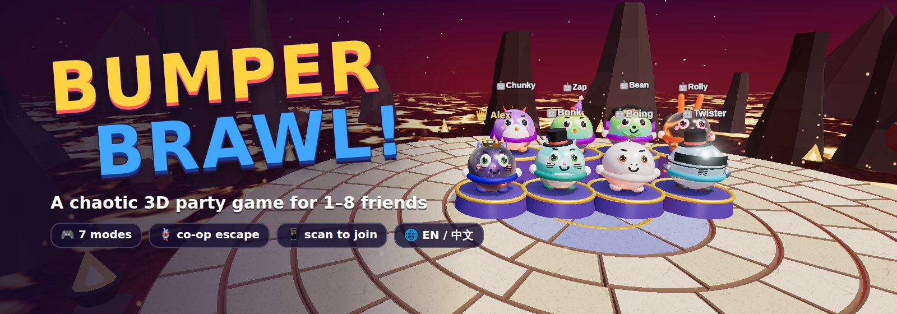

# 🎱 Bumper Brawl

**A chaotic 3D party game for 1–8 friends, right in your browser.**
Bump, dash and shove your friends off crumbling floating arenas — or rope up and escape together.

[](https://nodejs.org/)
[](https://threejs.org/)
[](#-game-modes)
[](#-play-with-friends-lan)
[](README.zh-CN.md)
[](#-tech)

**English** · [简体中文](README.zh-CN.md)

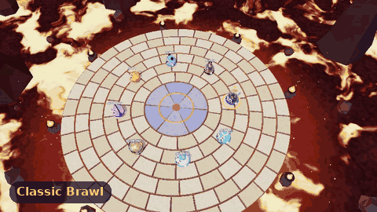

</div>

---

## ✨ Why you'll love it

- 🕹️ **Zero install for players** — one computer runs the server, everyone else just opens a browser (PC, Mac, phone, tablet)
- 📱 **Scan a QR code to join** — same Wi‑Fi, no accounts, no downloads
- 🎮 **7 very different modes** — free‑for‑all brawls, soccer, crown grab, paint wars, hot potato, a co‑op boss fight, and a **roped‑together co‑op escape**
- 🧸 **8 characters × 10 skins × 12 colors × 10 hats** — build your own little bumper buddy
- 💥 **Juicy hits** — squash & stretch, knockback tilt, dizzy stars, comic "POW!" words, screen shake, hit‑stop, bloom and particles
- 🎥 **Third person or first person** — press <kbd>V</kbd> any time
- 🌐 **English & 中文** — switch languages live, server messages are translated per player
- 🤖 **Smart bots** — fill empty seats with Easy / Normal / Hard bots
- 🔄 **One‑click updates** — the game checks GitHub and updates itself from the menu
- 🎨 **100% procedural** — every model, texture, sound effect and song is generated in code; no asset files

## 📸 Screenshots

<table>
<tr>
<td width="50%">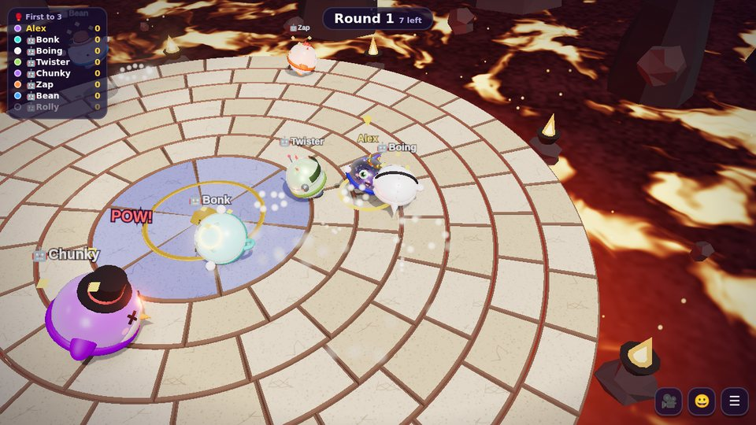<br><b>🥊 Classic Brawl</b> — last one standing on the Lava Isle</td>
<td width="50%">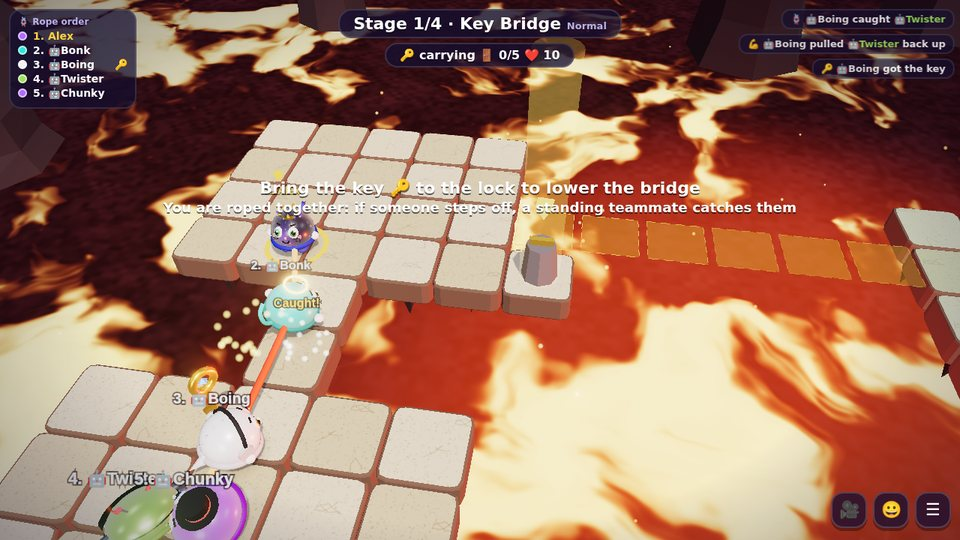<br><b>🪢 Rope Escape</b> — carry the key, lower the bridge, don't let go</td>
</tr>
<tr>
<td>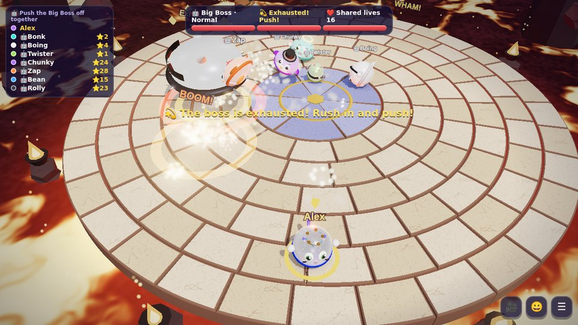<br><b>🤖 Boss Brawl</b> — dodge the slam, then push it off together</td>
<td>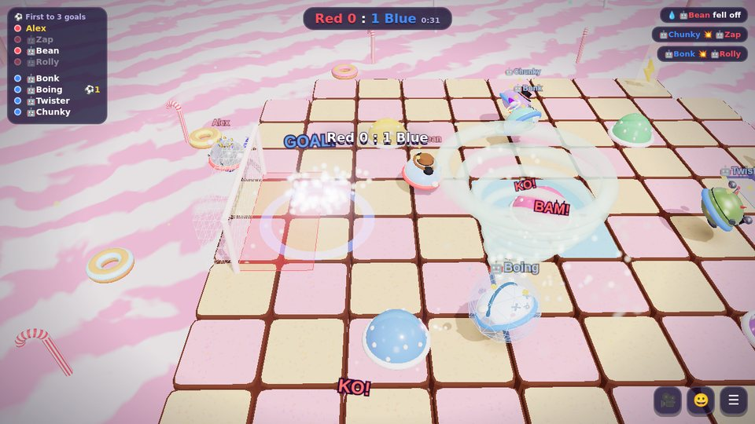<br><b>⚽ Bumper Soccer</b> — red vs blue with a giant beach ball</td>
</tr>
<tr>
<td>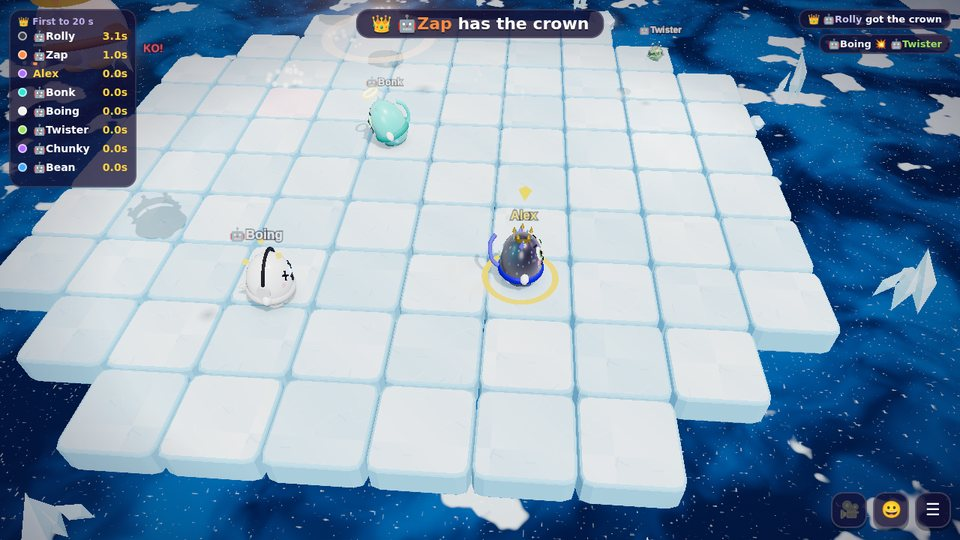<br><b>👑 Crown Grab</b> — hold the crown on slippery ice</td>
<td>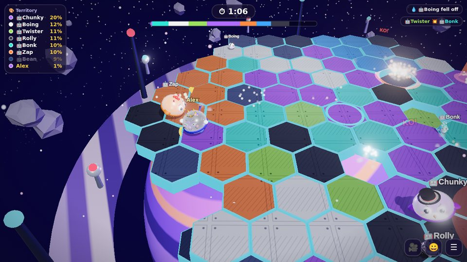<br><b>🎨 Paint Battle</b> — claim the most tiles before time runs out</td>
</tr>
<tr>
<td>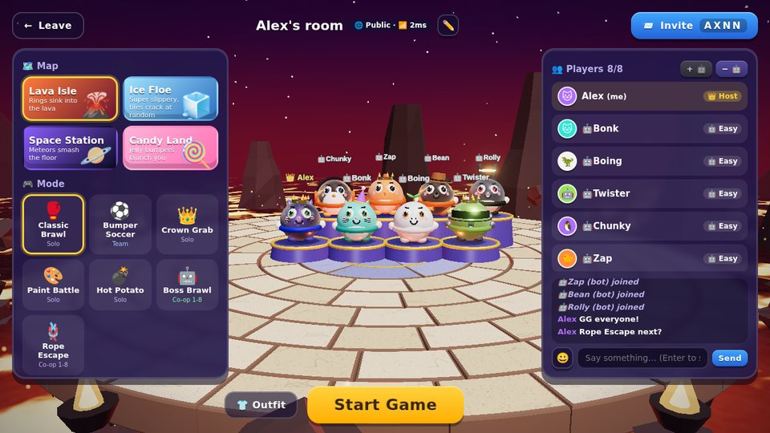<br><b>🏠 Party lobby</b> — host controls, teams, bots, chat & emotes</td>
<td>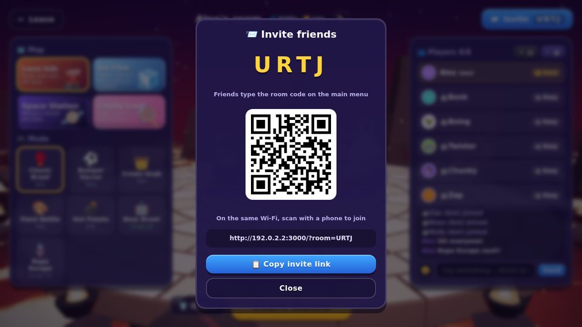<br><b>📨 Invite</b> — room code, QR code or LAN room list</td>
</tr>
<tr>
<td>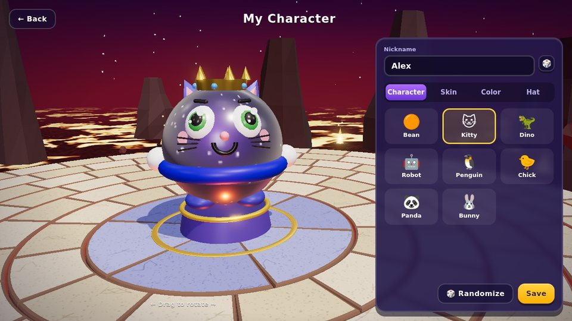<br><b>👕 Wardrobe</b> — characters, skins, colors and hats</td>
<td>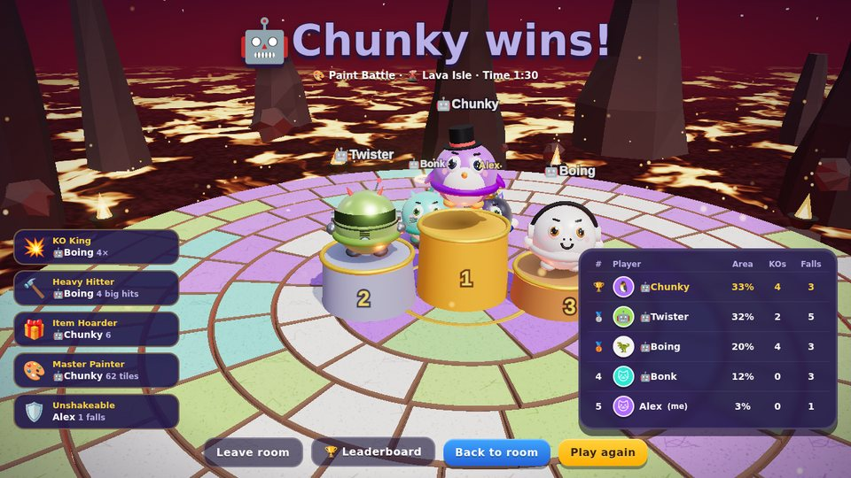<br><b>🏆 Results</b> — podium, awards and stats</td>
</tr>
<tr>
<td>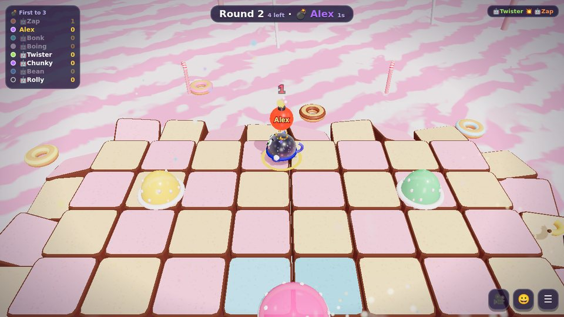<br><b>💣 Hot Potato</b> — one second left, pass it on!</td>
<td>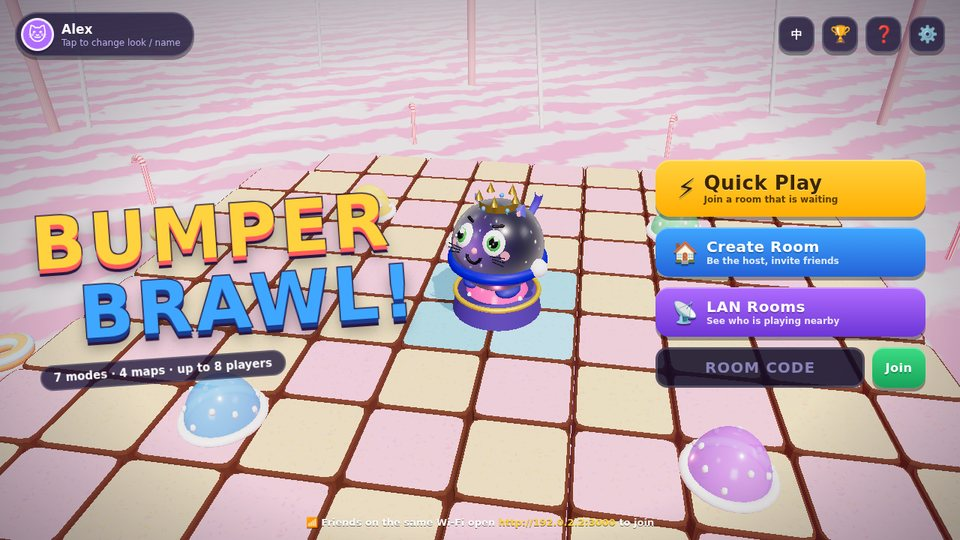<br><b>🎬 Title screen</b> — quick play, create a room or join by code</td>
</tr>
<tr>
<td>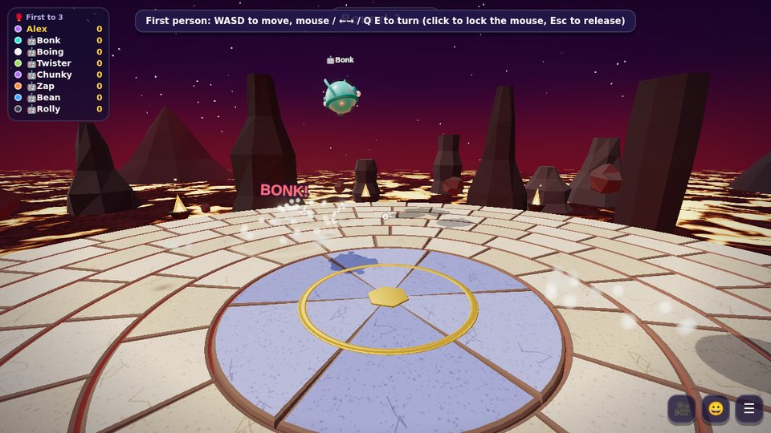<br><b>👁️ First person</b> — see the chaos up close</td>
<td>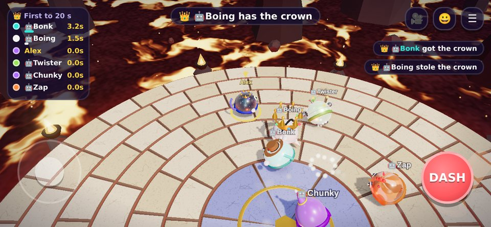<br><b>📱 Mobile</b> — virtual joystick and dash button</td>
</tr>
</table>

### 🪢 Rope Escape — the co‑op highlight

Everyone is tied together **1 → 2 → 3 → … → 8**. Four hand‑built stages, one rope, zero excuses.

<table>
<tr>
<td width="33%"><br><b>1 · Key Bridge</b><br>Carry the key to the lock to lower the drawbridge.</td>
<td width="33%">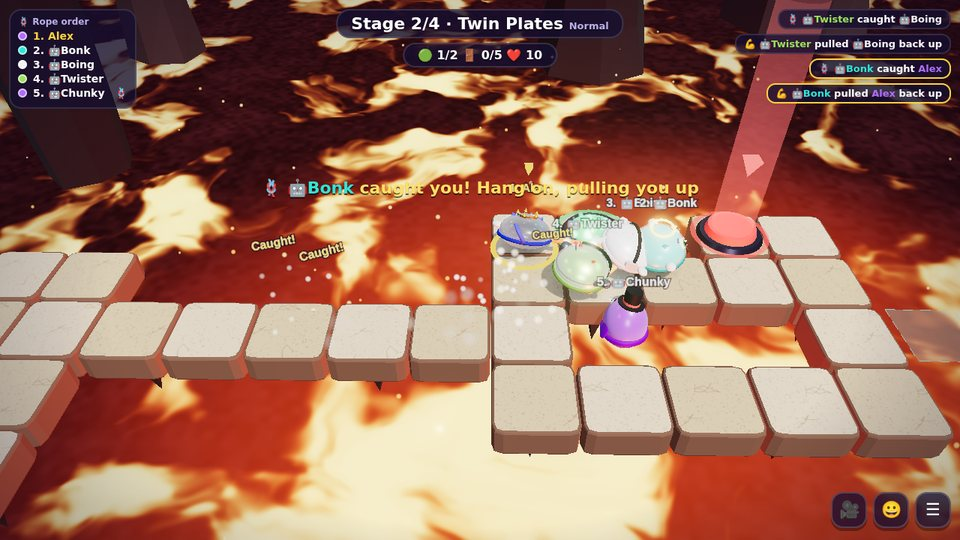<br><b>2 · Twin Plates</b><br>Two players must hold both plates at the same time.</td>
<td width="33%">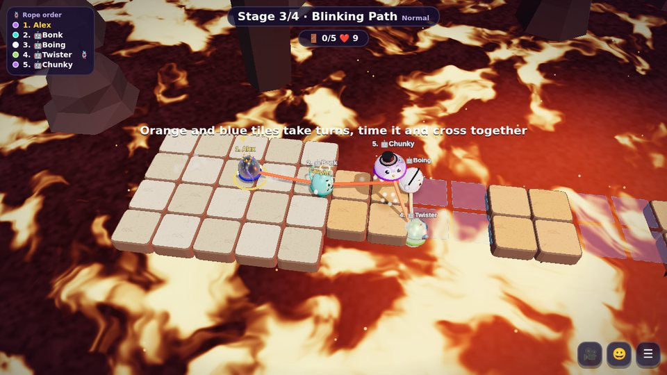<br><b>3 · Blinking Path</b><br>Orange and blue tiles take turns — cross together.</td>
</tr>
</table>

Step off an edge and a standing teammate catches you on the rope and reels you back in — but one person can only hold one teammate, so don't all jump at once. Stage 4 combines everything.

## 🚀 Quick start

You need [Node.js](https://nodejs.org/) 18 or newer.

```bash
git clone https://github.com/khaichonggg/Game.git
cd Game
npm install
npm start
```

Open **http://localhost:3000** — that's it. The console also prints a LAN address for your friends:

```
Bumper Brawl v2.1.0 running at http://localhost:3000
  Friends on your network can open: http://192.168.1.23:3000
```

> 💡 No Git? Click **Code → Download ZIP** on GitHub, unzip, and run the same `npm install` / `npm start` inside the folder.

## 📶 Play with friends (LAN)

1. One computer runs `npm start` — that's the server, keep the window open.
2. Friends join the **same Wi‑Fi** and open the LAN address shown in the console.
3. The host clicks **Create Room → Invite**. Friends can **scan the QR code**, type the **4‑letter room code**, or pick the room from **LAN Rooms**.
4. On Windows, allow the firewall prompt for **Private networks** the first time.

Want to play over the internet? Deploy to any Node + WebSocket host (Render, Railway, Fly.io, your own VPS…) with `npm start`; the port comes from `PORT`.

### Party features

| | |
| --- | --- |
| 👑 **Host controls** | map, mode, goal, max players (2–8), bot difficulty, power‑ups, public/private, room name |
| 🔁 **Host transfer** | hand over the crown, or it passes on automatically when the host leaves |
| 🚪 **Kick** | kicked players can't rejoin that room |
| ✅ **Ready check** | the host gets a confirmation if someone isn't ready |
| 🔴🔵 **Teams** | auto‑balanced, switch sides, host can shuffle |
| 💬 **Chat & emotes** | lobby chat, 8 emotes in the lobby and in game |
| 🔌 **Reconnect** | refresh or drop out and you're put back in your seat; a bot covers for you in game |
| ➕ **Join mid‑game** | respawn modes put you straight in, elimination modes next round |

## 🎮 Game modes

| Mode | Type | How to win |
| --- | --- | --- |
| 🥊 **Classic Brawl** | Solo · elimination | Be the last one standing. The outer rings collapse, so the arena keeps shrinking. |
| ⚽ **Bumper Soccer** | Red vs Blue | Body‑check a giant ball into the other team's goal. |
| 👑 **Crown Grab** | Solo · respawn | Your timer runs while you wear the crown — hit the wearer hard to steal it. |
| 🎨 **Paint Battle** | Solo · respawn | Tiles you touch take your color. Most territory at the buzzer wins. |
| 💣 **Hot Potato** | Solo · elimination | Bump someone to pass the bomb before the fuse runs out. |
| 🤖 **Boss Brawl** | **Co‑op 1–8** | Push the Big Boss off the arena. It charges, slams and summons minions — hit it while it's exhausted. |
| 🪢 **Rope Escape** | **Co‑op 1–8** | The whole team is roped together 1‑2‑3… Carry the key to the lock, hold pressure plates together, cross blinking tiles, and get everyone to the exit. If you step off, a standing teammate catches you and reels you back in. |

### 🗺️ Maps

| Map | Twist |
| --- | --- |
| 🌋 **Lava Isle** | Rings sink into the lava one by one |
| 🧊 **Ice Floe** | Super slippery ice that cracks at random |
| 🪐 **Space Station** | Meteor showers smash through the floor |
| 🍭 **Candy Land** | Jelly bumpers launch you across the board |

### ⚡ Power‑ups

🍄 Giant · ⚡ Speed · 🛡️ Shield · 💣 Bomb · ❄️ Freeze · 👻 Ghost · 🌪️ Tornado · 🍌 Banana peels

## ⌨️ Controls

| | Move | Dash | More |
| --- | --- | --- | --- |
| 🖥️ **Keyboard** | <kbd>W</kbd><kbd>A</kbd><kbd>S</kbd><kbd>D</kbd> / arrows | <kbd>Space</kbd> / <kbd>Shift</kbd> / <kbd>J</kbd> | <kbd>V</kbd> first person · <kbd>1</kbd>–<kbd>8</kbd> emotes · <kbd>Esc</kbd> menu · <kbd>Enter</kbd> chat |
| 📱 **Touch** | drag the left half | big red button | drag the right half to turn in first person |

## 🔄 Updating

When a newer version is pushed to GitHub, a green **🆕 vX.Y.Z** badge appears on the main menu. Click it on the host computer and the game downloads the update, restarts the server and reloads everyone's page. Your leaderboard is kept. (Set `HTTPS_PROXY` if you need a proxy to reach GitHub.)

## 🛠 Tech

- **Server:** Node.js + [`ws`](https://github.com/websockets/ws), server‑authoritative physics at 60 Hz, snapshots at 30 Hz, pluggable mode hooks, grid‑pathfinding bots
- **Client:** vanilla ES modules + [Three.js](https://threejs.org/) (bloom, environment reflections, instanced ropes, custom shaders for lava / sea / sky)
- **Audio:** WebAudio‑synthesized sound effects and step‑sequenced music
- **No build step, no asset files** — `public/` is served as‑is

```
server.js            HTTP + WebSocket entry, room list, leaderboard, update API
launcher.js          restarts the server after an in‑game update
server/room.js       lobby, host powers, match flow, physics
server/modes.js      the 7 game modes
server/levels.js     Rope Escape stages (ASCII maps)
server/bots.js       bot AI
server/updater.js    GitHub version check & self‑update
public/js/           client: UI, i18n, input, audio, 3D rendering
test/                automated tests (npm test)
```

## 🧪 Tests

```bash
npm test
```

Every mode is played to the end on every map by 8 bots, plus lobby/party protocol tests, a real‑server WebSocket test, updater tests and a check that every UI string has an English translation.

## ⭐ Like it?

If this made your game night better, please give the repo a **star** — it really helps! Bug reports and ideas are welcome in [Issues](https://github.com/khaichonggg/Game/issues).
