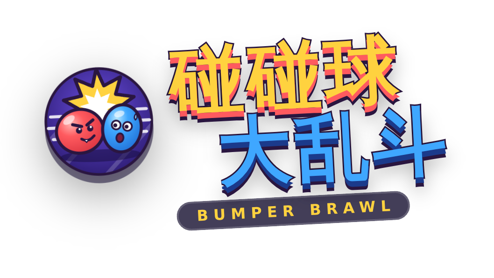
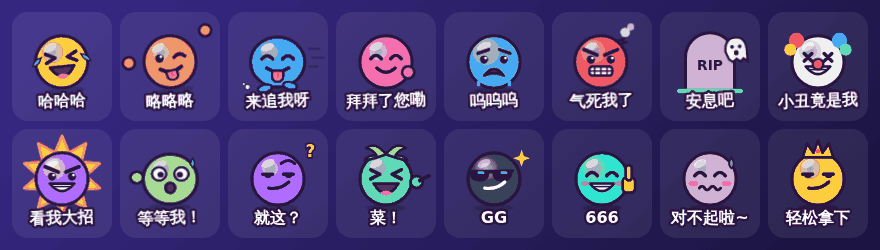

<div align="center">




# 碰碰球大乱斗 Bumper Brawl

**浏览器里就能玩的 3D 多人派对游戏，1~8 人同乐。**
在会塌、会滑、会下陨石的浮空场地上互相冲撞，把朋友撞下去——或者用绳子串成一串，一起闯关。

[English](README.md) · **简体中文**


</div>

---

## ✨ 特色

- 🕹️ **免安装**：下载后双击 `start.bat` / `start.command` 就能开服，其他人用浏览器打开就能玩（电脑、手机、平板都行）
- 🌍 **外网链接**：一键生成公网网址，不在同一个 Wi-Fi 的朋友也能加入
- 📱 **扫码进房**：同一个 Wi-Fi 下扫二维码直接加入，不用注册
- 🎮 **7 种玩法完全不同的模式**：乱斗、足球、抢皇冠、涂色、烫手炸弹、合力打 Boss，以及**绳索串联的协作闯关**
- 🧸 **8 种角色 × 10 种皮肤 × 12 种颜色 × 10 顶帽子**
- 💥 **打击感拉满**：挤压回弹、击退倾倒、眩晕星星、漫画字、屏幕震动、顿帧、泛光和粒子
- 😜 **嘲讽贴图**：16 个手绘贴图（其中 10 个会动），发出来会冒在头顶，角色还会跟着做动作：大笑、扭屁股、转圈、垂头丧气……按 <kbd>T</kbd> 一键再发，机器人也会嘲讽你！

  

- 🎥 **第三人称 / 第一人称**：随时按 <kbd>V</kbd> 切换
- 🌐 **中文 / English**：一键切换，服务器消息也按每个玩家的语言显示
- 🤖 **聪明的机器人**：简单 / 普通 / 困难，人不够随时补位
- 🔄 **游戏内一键更新**：GitHub 有新版本时菜单上会出现更新按钮
- 🎨 **全部程序生成**：模型、贴图、音效、音乐都是代码实时生成，没有任何素材文件

## 📸 截图

<table>
<tr>
<td width="50%"><br><b>🥊 经典乱斗</b>：熔岩浮岛上活到最后</td>
<td width="50%"><br><b>🪢 绳索闯关</b>：搬钥匙、放吊桥，千万别松手</td>
</tr>
<tr>
<td><br><b>🤖 合力打 Boss</b>：躲开砸地，一起把它推下去</td>
<td><br><b>⚽ 碰碰足球</b>：红蓝对抗，用身体顶球</td>
</tr>
<tr>
<td><br><b>👑 抢皇冠</b>：在滑溜溜的冰面上守住皇冠</td>
<td><br><b>🎨 涂色大战</b>：时间到时地盘最多的人赢</td>
</tr>
<tr>
<td><br><b>🏠 房间大厅</b>：房主设置、分队、机器人、聊天、表情</td>
<td><br><b>📨 邀请朋友</b>：房间码、二维码、局域网房间列表</td>
</tr>
<tr>
<td><br><b>💣 烫手炸弹</b>：只剩 1 秒，快传出去！</td>
<td><br><b>🎬 主菜单</b>：快速开始、创建房间、输入房间码</td>
</tr>
<tr>
<td><br><b>👁️ 第一人称</b>：近距离感受混乱</td>
<td><br><b>📱 手机</b>：虚拟摇杆 + 冲刺按钮</td>
</tr>
</table>

（截图是英文界面，游戏里可以随时切换成中文。）

## 🚀 快速开始（2 分钟）

1. 下载游戏：在 GitHub 页面点 **Code → Download ZIP** 并解压（或者 `git clone https://github.com/khaichonggg/Game.git`）。
2. 启动：
   - **Windows**：双击 **`start.bat`**，什么都不用装：电脑上没有 Node.js 的话，第一次运行会自动下载一个免安装版（约 30MB）放进 `runtime\` 文件夹
   - **macOS**：双击 **`start.command`**（第一次需要右键 → 打开）
   - **Linux**：运行 **`./start.sh`**

   （macOS / Linux 需要先安装一次 **[Node.js](https://nodejs.org/)** LTS 版本。）

浏览器会自动打开游戏。**不需要 `npm install`**，需要的东西都已经包含在里面了。

<details>
<summary>喜欢用命令行？</summary>

```bash
git clone https://github.com/khaichonggg/Game.git
cd Game
npm start            # 或者：node launcher.js
```

3000 端口被占用时会自动换下一个。也可以用 `PORT=8080` 指定端口；如果窗口里显示的局域网地址不对，可以用 `LAN_IP=192.168.1.5` 手动指定。
</details>

## 📶 和朋友联机（同一个 Wi-Fi）

游戏启动后，窗口里会显示给朋友用的地址**和一个二维码**：

1. 不要关掉这个窗口，这台电脑就是服务器。
2. 朋友连上**同一个 Wi-Fi**，用手机扫窗口里的二维码，或者在任何设备的浏览器里打开显示的地址。
3. 进游戏后，房主点「创建房间」→「邀请」可以看到房间二维码和 4 位房间码；朋友也可以在「局域网房间」里直接加入。
4. Windows 第一次运行时如果弹出防火墙提示，请勾选「专用网络」并点「允许访问」。

## 🌍 不在同一个 Wi-Fi（外网链接）

房主在「邀请」里切到 **🌍 外网链接** → **生成外网链接**，游戏会用免费的 [Cloudflare Quick Tunnel](https://developers.cloudflare.com/cloudflare-one/connections/connect-networks/do-more-with-tunnels/trycloudflare/) 生成一个 `https://….trycloudflare.com` 的公网网址和二维码，**不用注册、不用设置路由器**，发给任何地方的朋友都能打开。第一次使用会自动下载一个小组件 `cloudflared`；关掉游戏窗口后链接失效。

想要固定网址，也可以部署到任意支持 Node + WebSocket 的平台（Render、Railway、Fly.io、自己的服务器等），启动命令 `npm start`，端口读取环境变量 `PORT`。

### 房间与组队功能

| 功能 | 说明 |
| --- | --- |
| 👑 房主 | 改房间名、地图、模式、目标、人数上限（2~8）、机器人难度、道具开关、公开 / 私密 |
| 🔁 房主转让 | 点玩家头像 →「转让房主」；房主离开或掉线 6 秒后自动交给下一位 |
| 🚪 踢人 | 被踢的人不能再进这个房间 |
| ✅ 准备 | 有人没准备时，房主开局会二次确认 |
| 🔴🔵 分队 | 足球模式自动平衡，可以自己换队，房主可随机分队 |
| 💬 聊天 / 表情 | 大厅聊天，大厅和游戏里都能发 8 种表情（数字键 1~8） |
| 🔌 断线重连 | 刷新页面或断网后自动回到原位；比赛中 60 秒内由机器人代打 |
| 🌍 外网链接 | 一键生成公网网址和二维码，不在同一个 Wi-Fi 也能玩 |
| ➕ 中途加入 | 可复活的模式直接上场，淘汰制下一局上场 |
| 🏁 中途结束 | 房主可以在菜单里结束当前比赛 |

## 🎮 模式

| 模式 | 类型 | 规则 |
| --- | --- | --- |
| 🥊 经典乱斗 | 个人 · 淘汰 | 把所有人撞下去，每局活到最后的人得 1 分；外圈会塌 |
| ⚽ 碰碰足球 | 红蓝团队 | 用身体把大球撞进对方球门 |
| 👑 抢皇冠 | 个人 · 复活 | 戴着皇冠就计时，用力撞戴冠的人就能抢走 |
| 🎨 涂色大战 | 个人 · 复活 | 走过的地砖变成你的颜色，时间到时地盘最多的人赢 |
| 💣 烫手炸弹 | 个人 · 淘汰 | 撞到谁就把炸弹传给谁，引信烧完还拿着的人出局 |
| 🤖 合力打 Boss | **协作 1~8 人** | 一起把巨无霸推下场地。它会蓄力冲撞、跳起砸地、召唤小怪；放完大招会累趴一会儿，这时最好推。超过 2 分钟它会狂暴，场地也开始坍塌 |
| 🪢 绳索闯关 | **协作 1~8 人** | 全队按 1-2-3… 用绳子串在一起闯 4 关：拿钥匙开锁放吊桥、两人同时踩住压力板、踩着轮流出现的闪烁地砖过河，所有人都站到终点岛才算过关。踩空时站稳的队友会把你吊住拉回来（一个人只拉得住一个） |

### 🪢 绳索闯关的 4 关

| 关卡 | 任务 |
| --- | --- |
| 1 · 钥匙吊桥 | 把钥匙 🔑 送到锁台，吊桥放下 |
| 2 · 双人机关 | 两块压力板要同时有人踩住（一个人玩时踩过的板会亮几秒） |
| 3 · 闪烁之路 | 橙色和蓝色地砖轮流出现，看准时机一起冲 |
| 4 · 终极挑战 | 钥匙、压力板、闪烁地砖全都有 |

地图决定关卡的主题和手感（冰面超滑！）。难度影响共享复活次数、闪烁速度和被吊住时能坚持多久。

### 🗺️ 地图

| 地图 | 机关 |
| --- | --- |
| 🌋 熔岩浮岛 | 外圈一层层坍塌进岩浆 |
| 🧊 冰川碎冰 | 冰面很滑，冰块随机碎裂 |
| 🪐 星际空间站 | 陨石雨砸穿地板 |
| 🍭 糖果乐园 | 软糖弹簧把人弹飞 |

### ⚡ 道具

🍄 巨大化 · ⚡ 加速 · 🛡️ 护盾 · 💣 炸弹 · ❄️ 冰冻 · 👻 幽灵 · 🌪️ 龙卷风 · 🍌 香蕉皮

## ⌨️ 操作

| | 移动 | 冲刺 | 其他 |
| --- | --- | --- | --- |
| 🖥️ 电脑 | <kbd>W</kbd><kbd>A</kbd><kbd>S</kbd><kbd>D</kbd> / 方向键 | <kbd>空格</kbd> / <kbd>Shift</kbd> / <kbd>J</kbd> | <kbd>F</kbd> 使用道具 · <kbd>V</kbd> 第一人称 · <kbd>1</kbd>~<kbd>8</kbd> 表情 · <kbd>T</kbd> 嘲讽贴图 · <kbd>Esc</kbd> 菜单 · <kbd>回车</kbd> 聊天 |
| 📱 手机 | 左半屏拖动摇杆 | 右下角红色按钮（旁边是道具按钮） | 第一人称时右半屏左右拖动转向 |

第一人称下，电脑用鼠标（点一下画面锁定鼠标）、←→ 或 Q / E 转向。

## 🔄 自动更新

GitHub 上有新版本时，主菜单右上角会出现绿色的 **🆕 vX.Y.Z** 按钮。在开服的电脑上点它，游戏会自动下载新版本、重启服务器，所有人的页面会自动刷新，排行榜数据会保留。（需要开代理才能访问 GitHub 的话，请在启动前设置 `HTTPS_PROXY` 环境变量。）

## 🧪 测试

```bash
npm test
```

每种模式 × 每张地图用 8 个机器人完整打一遍，外加大厅 / 组队协议测试、真实服务器 WebSocket 测试、自动更新测试，以及检查所有界面文字都有英文翻译。

## 🛠 结构

```
server.js            入口：静态文件、房间列表、排行榜、更新接口、WebSocket、主循环
launcher.js          启动器：游戏内更新后自动重启服务器
server/room.js       房间：大厅、房主权限、比赛流程、物理
server/modes.js      7 种模式的规则
server/levels.js     绳索闯关的关卡（字符画）
server/bots.js       机器人 AI
server/updater.js    检查 GitHub 新版本并自动更新
server/tunnel.js     外网链接（Cloudflare Quick Tunnel）
server/lan.js        找局域网地址、控制台二维码
server/vendor/ws/    自带的 WebSocket 库（MIT），不需要 npm install
start.bat / start.command / start.sh   双击启动脚本
public/js/           客户端：界面、双语、输入、音效、3D 渲染
public/js/stickers.js 嘲讽贴图（SVG + CSS 动画）
public/logo.svg      Logo / 网页图标（手机桌面图标在 public/icons/）
test/                自动化测试
```

排行榜数据保存在 `data/leaderboard.json`，删除这个文件即可清空。

## ⭐ 喜欢的话

如果它让你们的游戏之夜更开心，请给仓库点一个 **Star**，这对我帮助很大！有 bug 或想法欢迎提 [Issues](https://github.com/khaichonggg/Game/issues)。
